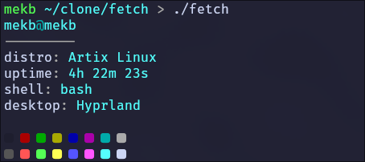

<h3 align="center">Fetch</h3>
<h4 align="center">
Customizable fetch program in bash which uses no external processes except for bash
</h4>

Please create an issue if you believe there is a bug, or an external process being used, or if you think something should be added
